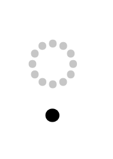

# Designing Latin S

With [Latin S](https://github.com/koeberlin/Latin-Character-Sets) I proposed a new standard Latin character set that supports more than the European languages.
Some of the additional characters might be unknown to type designers though, so here’s a closer look.

## Overview
Additional characters to the common practice are marked green (currency symbols yellow, and the red ones might be omitted):

That makes about 80 additional glyphs – which serve more than 200 million addiotional speakers!

The example images below show the glyphs as sans serif ([Pangea Text](https://fontwerk.com/fonts/pangea-text)) and serif ([Brill](https://brill.com/page/BrillFont/brill-typeface)) designs.

## ◌̣

| Char | Unicode | AGLFN name | 
| --- | --- | --- |
| ̣ | 0323 | dotbelowcomb |

Ok, let’s start with an accent. You probably already have ◌̇ ([/dotaccentcomb](https://codepoints.net/U+0307)), so you just need to duplicate it and move the outline below the baseline.

## ẠḄḌẸḤỊṆỌṢỤẒ ạḅḍẹḥịṇọṣụẓ

Show character table

| Char | Unicode | AGLFN name | 
| --- | --- | --- |
| Ạ | 1EA0 | uni1EA0 |
| Ḅ | 1E04 | uni1E04 |
| Ḍ | 1E0C | uni1E0C |
| Ẹ | 1EB8 | uni1EB8 |
| Ḥ | 1E24 | uni1E24 |
| Ị | 1ECA | uni1ECA |
| Ṇ | 1E46 | uni1E46 |
| Ọ | 1ECC | uni1ECC |
| Ṣ | 1E62 | uni1E62 |
| Ụ | 1EE4 | uni1EE4 |
| Ẓ | 1E92 | uni1E92 |
| ạ | 1EA1 | uni1EA1 |
| ḅ | 1E05 | uni1E05 |
| ḍ | 1E0D | uni1E0D |
| ẹ | 1EB9 | uni1EB9 |
| ḥ | 1E25 | uni1E25 |
| ị | 1ECB | uni1ECB |
| ṇ | 1E47 | uni1E47 |
| ọ | 1ECD | uni1ECD |
| ṣ | 1E63 | uni1E63 |
| ụ | 1EE5 | uni1EE5 |
| ẓ | 1E93 | uni1E93 |

Now you can easily create these ones!

## ǍẼḠǦḦǏṄǑṖǓẌỲỸȲ/Jacute ǎẽḡǧḧǐṅǒṗǔẍỳỹȳ/jacute

Show character table

| Char | Unicode | AGLFN name | 
| --- | --- | --- |
| Ǎ | 01CD | uni01CD |
| Ẽ | 1EBC | uni1EBC |
| Ḡ | 1E20 | uni1E20 |
| Ǧ | 01E6 | Gcaron |
| Ḧ | 1E26 | uni1E26 |
| Ǐ | 01CF | uni01CF |
| Ṅ | 1E44 | uni1E44 |
| Ǒ | 01D1 | uni01D1 |
| Ṗ | 1E56 | uni1E56 |
| Ǔ | 01D3 | uni01D3 |
| Ẍ | 1E8C | uni1E8C |
| Ỳ | 1EF2 | Ygrave |
| Ỹ | 1EF8 | uni1EF8 |
| Ȳ | 0232 | uni0232 |
|  | None | J.latnNLD |
| ǎ | 01CE | uni01CE |
| ẽ | 1EBD | uni1EBD |
| ḡ | 1E21 | uni1E21 |
| ǧ | 01E7 | gcaron |
| ḧ | 1E27 | uni1E27 |
| ǐ | 01D0 | uni01D0 |
| ṅ | 1E45 | uni1E45 |
| ǒ | 01D2 | uni01D2 |
| ṗ | 1E57 | uni1E57 |
| ǔ | 01D4 | uni01D4 |
| ẍ | 1E8D | uni1E8D |
| ỳ | 1EF3 | ygrave |
| ỹ | 1EF9 | uni1EF9 |
| ȳ | 0233 | uni0233 |
|  | None | j.latnNLD |

You already have all the base letters, you already have the accents, now compose these!

## ʼʻ

| Char | Unicode | AGLFN name | 
| --- | --- | --- |
| ʼ | 02BC | uni02BC |
| ʻ | 02BB | uni02BB |

Just duplicate /quoteleft/quoteright – done! 

Congrats, you already completed more than 60% of the additional glyphs! 🎉

## Ɲɲ

| Char | Unicode | AGLFN name | 
| --- | --- | --- |
| Ɲ | 019D | uni019D |
| ɲ | 0272 | uni0272 |

If your /N and /J are ready, just combine those two.

## Ʌʌ

| Char | Unicode | AGLFN name | 
| --- | --- | --- |
| Ʌ | 0245 | uni0245 |
| ʌ | 028C | uni028C |

You aready have these glyphs, only turned. 🙃

## Ɔɔ

| Char | Unicode | AGLFN name | 
| --- | --- | --- |
| Ɔ | 0186 | uni0186 |
| ɔ | 0254 | uni0254 |

Turning /C and /c might do the trick here, too!

## Ɛɛ

| Char | Unicode | AGLFN name | 
| --- | --- | --- |
| Ɛ | 0190 | uni0190 |
| ɛ | 025B | uni025B |

Numeral 3 might be a good starting point for these, or you re-use the Cyrillic letters Зз ([/Ze](https://codepoints.net/U+0417) [/ze](https://codepoints.net/U+0437)) or the Greek ε ([/epsilon](https://codepoints.net/U+03B5))

## Ǝǝ

| Char | Unicode | AGLFN name | 
| --- | --- | --- |
| Ǝ | 018E | uni018E |
| ǝ | 01DD | uni01DD |

Mirroring /E and turning /e will probably all you need to do about these two!

## Ɨɨ

| Char | Unicode | AGLFN name | 
| --- | --- | --- |
| Ɨ | 0197 | uni0197 |
| ɨ | 0268 | uni0268 |

Just add strokes to /I and /i. Maybe have a look at your [/Eth](https://codepoints.net/U+00D0) and [/dcroat](https://codepoints.net/U+0111).

## ƁƊƘƳ ɓɗƙƴ

| Char | Unicode | AGLFN name | 
| --- | --- | --- |
| Ɓ | 0181 | uni0181 |
| Ɗ | 018A | uni018A |
| Ƙ | 0198 | uni0198 |
| Ɲ | 019D | uni019D |
| Ƴ | 01B3 | uni01B3 |
| ɓ | 0253 | uni0253 |
| ɗ | 0257 | uni0257 |
| ƙ | 0199 | uni0199 |
| ɲ | 0272 | uni0272 |
| ƴ | 01B4 | uni01B4 |

Now for some curls, and you’re nearly done!

## ẞƏə

| Char | Unicode | AGLFN name | 
| --- | --- | --- |
| ẞ | 1E9E | uni1E9E |
| Ə | 018F | uni018F |
| ə | 0259 | uni0259 |

Uppercase Eszett and the Latin Schwas are already included in many fonts but I added them for the sake of completeness.

ə is a turned /e, the uppercase variant is basically the same, only scaled. If you already designed the Cyrillic [Ә](https://codepoints.net/U+04D8) & [ә](https://codepoints.net/U+04D9): They’re identical.

On Typefacts I wrote some more about the [German Capital Letter Eszett](https://typefacts.com/en/blog/the-german-capital-letter-eszett).

## Ŋ

| Char | Unicode | AGLFN name | 
| --- | --- | --- |
| Ŋ | 014A | Eng |

There are two shape variants for the uppercase /Eng: One preferred in Sami languages (based on the uppercase /N) and one preferred in Afrikan languages (looking like the lowercase /n).
(Brill even has three different shapes, see image)

I’d recommend the latter one as default since it is used by many more speakers than the Sami shape. 

You might want to draw both shapes thought and substitute them in the `locl`
feature, see [Latin Character Sets > Eng](https://github.com/koeberlin/Latin-Character-Sets#eng-%C5%8B).

## Ŀŀ

| Char | Unicode | AGLFN name | 
| --- | --- | --- |
| Ŀ | 013F | Ldot |
| ŀ | 0140 | ldot |

These only occur in Catalan in the combinations /L/periodcentered/L and /l/periodcentered/l. I recommend using unencoded glyphs instead, in combination with the `locl` feature, see [Latin Character Sets > L_periodcentered.latnCAT](https://github.com/koeberlin/Latin-Character-Sets#l_periodcenteredlatncatl_periodcenteredlatncat).

## ₵₡₲₺₼₦

| Char | Unicode | AGLFN name | 
| --- | --- | --- |
| ₵ | 20B5 | uni20B5 |
| ₡ | 20A1 | colonmonetary |
| ₲ | 20B2 | uni20B2 |
| ₺ | 20BA | uni20BA |
| ₼ | 20BC | uni20BC |
| ₦ | 20A6 | uni20A6 |

If your font supports certain languages, you might consider also supporting the  currency symbols of the countries where they are spoken:

* ₵: Cedi (Ghana)
* ₡: Colón (Costa Rica)
* ₲: Guaraní (Paraguay)
* ₺:  Lira (Turkey)
* ₼: Manat (Azerbaijan)
* ₦: Naira (Nigeria)

## IJijŦŧĸʼnſ

| Char | Unicode | AGLFN name | 
| --- | --- | --- |
| IJ | 0132 | IJ |
| ij | 0133 | ij |
| Ŧ | 0166 | Tbar |
| ŧ | 0167 | tbar |
| ĸ | 0138 | kgreenlandic |
| ʼn | 0149 | napostrophe |
| ſ | 017F | longs |

You won’t necessarily need these glyphs from Unicode range Latin Extended A.

* IJ, ij: If you want to draw these ligatures, I recommend using unencoded glyphs in combination with OpenType features
* Ŧ, ŧ are needed for Sami languages only (≈25,000 speakers) or Balante language in Senegal (≈100,000 speakers)
* ĸ is a historical letter used in Greenlandic until the 1970s and Labrador Inuttut until the 1980s
* ʼn is deprecated and shouldn't be used
* ſ is an historical form of s

## Kerning
In most of the cases you can reuse kerning classes for your existing character set, eg.:

| Char | Left Kern Group | Right Kern Group | 
| --- | --- | --- |
| Ʌ | A | A |

## Kern ƁƊ
| Char | Left Kern Group | Right Kern Group | 
| --- | --- | --- |
| Ɓ | Hook | B |
| Ɗ | Hook | O |

The minimum Kerning:

| Kerning Pair | Example Word | Translation | 
| --- | --- | --- |
| AƁ | GÁAƁÀA | the shore |
| KƁ | - | - |
| LƁ | - | - |

