# Diseño de Latin S

Con [Latin S](https://github.com/koeberlin/Latin-Character-Sets) propuse un nuevo conjunto de caracteres latinos estándar que admite más que las lenguas europeas.
Sin embargo, algunos de los caracteres adicionales pueden ser desconocidos para los diseñadores de tipos, así que aquí hay una mirada en detalle.

## Resumen
Los caracteres adicionales a la práctica común están marcados en verde (los símbolos monetarios en amarillo, y los rojos podrían omitirse):

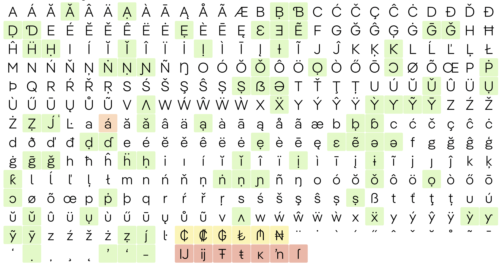

Esto hace que haya unos 80 glifos adicionales, que sirven a más de 200 millones de hablantes adicionales.

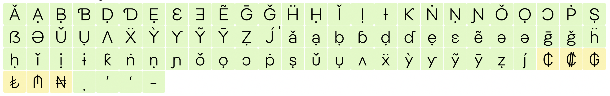

Las siguientes imágenes de ejemplo muestran los glifos como diseños sans serif ([Pangea Text](https://fontwerk.com/fonts/pangea-text)) y serif ([Brill](https://brill.com/page/BrillFont/brill-typeface)).

## ◌̣
#[dotbelowcomb](img/01_dotbelowcomb.png)

| Char | Unicode | AGLFN name | 
| --- | --- | --- |
| ̣ | 0323 | dotbelowcomb |

Bien, empecemos con un acento. Probablemente ya tengas ◌̇ ([/dotaccentcomb](https://codepoints.net/U+0307)), así que solo tienes que duplicarlo y mover el contorno por debajo de la línea de base.

## ẠḄḌẸḤỊṆỌṢỤẒ ạḅḍẹḥịṇọṣụẓ
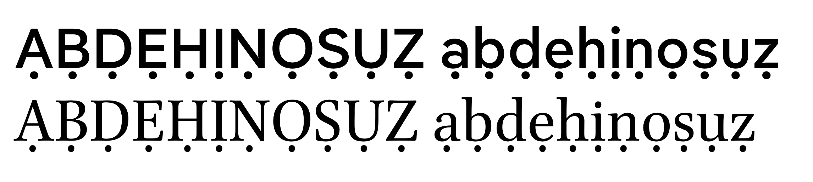

Mostrar tabla de caracteres

| Char | Unicode | AGLFN name | 
| --- | --- | --- |
| Ạ | 1EA0 | uni1EA0 |
| Ḅ | 1E04 | uni1E04 |
| Ḍ | 1E0C | uni1E0C |
| Ẹ | 1EB8 | uni1EB8 |
| Ḥ | 1E24 | uni1E24 |
| Ị | 1ECA | uni1ECA |
| Ṇ | 1E46 | uni1E46 |
| Ọ | 1ECC | uni1ECC |
| Ṣ | 1E62 | uni1E62 |
| Ụ | 1EE4 | uni1EE4 |
| Ẓ | 1E92 | uni1E92 |
| ạ | 1EA1 | uni1EA1 |
| ḅ | 1E05 | uni1E05 |
| ḍ | 1E0D | uni1E0D |
| ẹ | 1EB9 | uni1EB9 |
| ḥ | 1E25 | uni1E25 |
| ị | 1ECB | uni1ECB |
| ṇ | 1E47 | uni1E47 |
| ọ | 1ECD | uni1ECD |
| ṣ | 1E63 | uni1E63 |
| ụ | 1EE5 | uni1EE5 |
| ẓ | 1E93 | uni1E93 |

¡Ahora puedes hacer estos otros!

## ǍẼḠǦḦǏṄǑṖǓẌỲỸȲ/Jacute ǎẽḡǧḧǐṅǒṗǔẍỳỹȳ/jacute
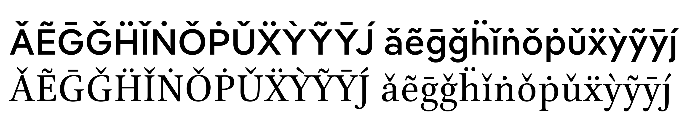

Mostrar tabla de caracteres

| Char | Unicode | AGLFN name | 
| --- | --- | --- |
| Ǎ | 01CD | uni01CD |
| Ẽ | 1EBC | uni1EBC |
| Ḡ | 1E20 | uni1E20 |
| Ǧ | 01E6 | Gcaron |
| Ḧ | 1E26 | uni1E26 |
| Ǐ | 01CF | uni01CF |
| Ṅ | 1E44 | uni1E44 |
| Ǒ | 01D1 | uni01D1 |
| Ṗ | 1E56 | uni1E56 |
| Ǔ | 01D3 | uni01D3 |
| Ẍ | 1E8C | uni1E8C |
| Ỳ | 1EF2 | Ygrave |
| Ỹ | 1EF8 | uni1EF8 |
| Ȳ | 0232 | uni0232 |
|  | None | J.latnNLD |
| ǎ | 01CE | uni01CE |
| ẽ | 1EBD | uni1EBD |
| ḡ | 1E21 | uni1E21 |
| ǧ | 01E7 | gcaron |
| ḧ | 1E27 | uni1E27 |
| ǐ | 01D0 | uni01D0 |
| ṅ | 1E45 | uni1E45 |
| ǒ | 01D2 | uni01D2 |
| ṗ | 1E57 | uni1E57 |
| ǔ | 01D4 | uni01D4 |
| ẍ | 1E8D | uni1E8D |
| ỳ | 1EF3 | ygrave |
| ỹ | 1EF9 | uni1EF9 |
| ȳ | 0233 | uni0233 |
|  | None | j.latnNLD |

Ya tienes todas las letras base, también los acentos, ¡ahora a componerlos!

## ʼʻ
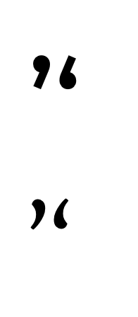

| Char | Unicode | AGLFN name | 
| --- | --- | --- |
| ʼ | 02BC | uni02BC |
| ʻ | 02BB | uni02BB |

Simplemente duplicar /quoteleft/quoteright – ¡listo! 

felicitaciones, ya completaste más del 60% de los glifos adicionales! 🎉

## Ɲɲ
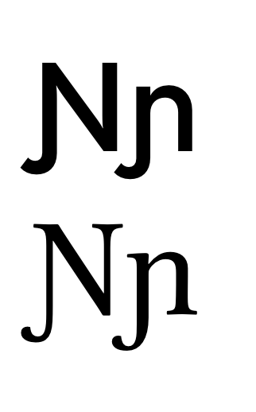

| Char | Unicode | AGLFN name | 
| --- | --- | --- |
| Ɲ | 019D | uni019D |
| ɲ | 0272 | uni0272 |

si tu /N y /J están listo, combínalas.

## Ʌʌ
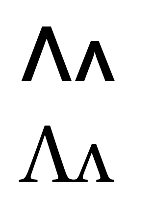

| Char | Unicode | AGLFN name | 
| --- | --- | --- |
| Ʌ | 0245 | uni0245 |
| ʌ | 028C | uni028C |

Estos ya los tienes, pero invertidos. 🙃

## Ɔɔ

| Char | Unicode | AGLFN name | 
| --- | --- | --- |
| Ɔ | 0186 | uni0186 |
| ɔ | 0254 | uni0254 |

/C invertida y /c deberían hacer el truco.

## Ɛɛ
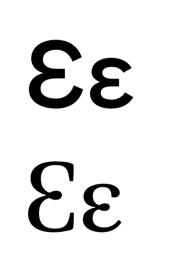

| Char | Unicode | AGLFN name | 
| --- | --- | --- |
| Ɛ | 0190 | uni0190 |
| ɛ | 025B | uni025B |

Número 3 es un buen punto de partida para este, o puedes reciclar las letras Зз Cirílico.  ([/Ze](https://codepoints.net/U+0417) [/ze](https://codepoints.net/U+0437)) o la griega ε ([/epsilon](https://codepoints.net/U+03B5))

## Ǝǝ
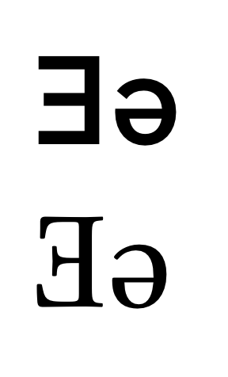

| Char | Unicode | AGLFN name | 
| --- | --- | --- |
| Ǝ | 018E | uni018E |
| ǝ | 01DD | uni01DD |

/E reflejada y la e /e dada vuelta, debería ser todo lo que necesitas para esta dos.

## Ɨɨ
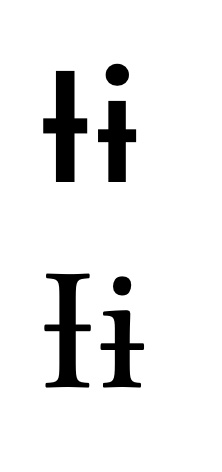

| Char | Unicode | AGLFN name | 
| --- | --- | --- |
| Ɨ | 0197 | uni0197 |
| ɨ | 0268 | uni0268 |

Agrégale las barras (strokes) a /I y a /i. Quizás debas mirar tu [/Eth](https://codepoints.net/U+00D0) and [/dcroat](https://codepoints.net/U+0111).

## ƁƊƘƳ ɓɗƙƴ

| Char | Unicode | AGLFN name | 
| --- | --- | --- |
| Ɓ | 0181 | uni0181 |
| Ɗ | 018A | uni018A |
| Ƙ | 0198 | uni0198 |
| Ɲ | 019D | uni019D |
| Ƴ | 01B3 | uni01B3 |
| ɓ | 0253 | uni0253 |
| ɗ | 0257 | uni0257 |
| ƙ | 0199 | uni0199 |
| ɲ | 0272 | uni0272 |
| ƴ | 01B4 | uni01B4 |

Ahora algunos rulos, ya casi terminamos!

## ẞƏə

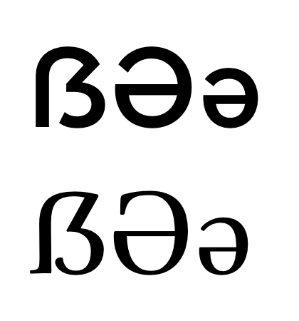

| Char | Unicode | AGLFN name | 
| --- | --- | --- |
| ẞ | 1E9E | uni1E9E |
| Ə | 018F | uni018F |
| ə | 0259 | uni0259 |

Eszett mayúsculas y los Schwas latinos ya están incluídos en algunas fuentes pero los vamos agregar en nombre de la totalidad.

ə es una /e reflejada, y la mayúsculas es basicamente la misma, pero escalada, deberías cuidar el grosor de la línea nada más. si ya diseñaste el cirílico [Ә](https://codepoints.net/U+04D8) y [ә](https://codepoints.net/U+04D9): ya está, porque son idénticas.

En el sitio web Typefacts escribí un poco más sobre las [German Capital Letter Eszett](https://typefacts.com/en/blog/the-german-capital-letter-eszett).

## Ŋ
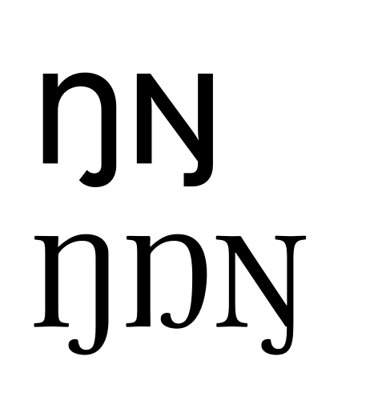

| Char | Unicode | AGLFN name | 
| --- | --- | --- |
| Ŋ | 014A | Eng |

Hay dos variantes para el /Eng: Una que es preferida en las lenguas Sami (basada en la /N mayúscula) y una que se prefiere en las lenguas Africanas (que se ve como la /n minúscula con su grosor ajustado)
(Brill incluso tiene tres formas diferentes, como se ve en la imagen)

Yo recomiendo dejar la última por defecto (basada en /n), ya que es usada por la mayor cantidad de hablantes que la forma usada en Sami (basada en /N). 

Podrías dibujar ambas y luego sustituírlas con opentype usando la característica `locl`, mira [Latin Character Sets > Eng](https://github.com/koeberlin/Latin-Character-Sets#eng-%C5%8B).

## Ŀŀ

| Char | Unicode | AGLFN name | 
| --- | --- | --- |
| Ŀ | 013F | Ldot |
| ŀ | 0140 | ldot |

Estas solo se usan en Catalán en las combinaciones /L/periodcentered/L y /l/periodcentered/l. Yo recomiendo usar glifos sin codificar (unencoded), en combinación con la característica`locl`, mira [Latin Character Sets > L_periodcentered.latnCAT](https://github.com/koeberlin/Latin-Character-Sets#l_periodcenteredlatncatl_periodcenteredlatncat).

## ₵₡₲₺₼₦
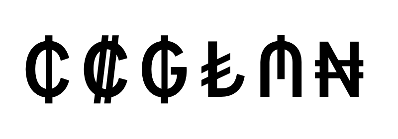

| Char | Unicode | AGLFN name | 
| --- | --- | --- |
| ₵ | 20B5 | uni20B5 |
| ₡ | 20A1 | colonmonetary |
| ₲ | 20B2 | uni20B2 |
| ₺ | 20BA | uni20BA |
| ₼ | 20BC | uni20BC |
| ₦ | 20A6 | uni20A6 |

Si ya estás soportando estas lenguas, deberías considerar los monetarios de los países donde son habladas:

* ₵: Cedi (Ghana)
* ₡: Colón (Costa Rica)
* ₲: Guaraní (Paraguay)
* ₺:  Lira (Turkey)
* ₼: Manat (Azerbaijan)
* ₦: Naira (Nigeria)

## IJijŦŧĸʼnſ

| Char | Unicode | AGLFN name | 
| --- | --- | --- |
| IJ | 0132 | IJ |
| ij | 0133 | ij |
| Ŧ | 0166 | Tbar |
| ŧ | 0167 | tbar |
| ĸ | 0138 | kgreenlandic |
| ʼn | 0149 | napostrophe |
| ſ | 017F | longs |

Estos últimos glifos no son imprescindibles para el rango Unicode Latin Extended A.

* IJ, ij: si quieres agregar estas ligaduras, te recomiendo usar glifos sin codificar y combinarlas con OpenType features
* Ŧ, ŧ solo se necesitan para las lenguas Sami (≈25,000 speakers)
* ĸ es obsoleto
* ʼn es obsoleto
* ſ es una forma histórica 
